# Visual Recognition Assignment - 1

## Part 1: Coin Detection and Segmentation

### Overview
This repository contains the implementation for Part I of the assignment, which focuses on detecting, segmenting, and counting coins from images containing scattered Indian coins using computer vision techniques.

### Features
- **Coin Detection**: Detects coins using various edge detection methods (Laplacian, Sobel, and Canny)
- **Coin Segmentation**: Isolates individual coins using region-based segmentation 
- **Coin Counting**: Accurately counts the number of coins in an image
- **Visualization**: Provides visual output with detected coins outlined in green

### Methods
This project implements several computer vision techniques:

1. **Edge Detection**: Three different edge detection methods are available:
   - **Laplacian**: Second-order derivative method for detecting rapid intensity changes
   - **Sobel**: First-order derivative method calculating gradients in horizontal and vertical directions
   - **Canny**: Multi-stage algorithm combining noise reduction, gradient calculation, and hysteresis thresholding

2. **Contour Filtering**: Coins are identified by filtering contours based on:
   - Area (between 100 and 5000 pixels)
   - Perimeter verification
   - Circularity calculation (between 0.7 and 2.0)

3. **Morphological Operations**: Morphological closing is applied to connect broken edges using rectangular structuring elements

4. **Coin Segmentation**: Individual coins are segmented using circular masks based on minimum enclosing circles

### Setup and Installation

#### Prerequisites
- Python 3.6+
- OpenCV
- NumPy

#### Installation
```bash
pip install numpy opencv-python
```

### Project Structure
```
├── coin_detection.py         # Main script for coin detection
├── photos/
│   └── coins/                # Folder containing coin images
├── output/
│   └── coins/                # Output directory for segmented coins
└── README.md
```

### Usage

#### Basic Usage
```bash
python coin_detection.py
```
This will process the default image (`photos/coins/coins-1.jpg`) using the Canny edge detection method.

#### Custom Image
```bash
python coin_detection.py path/to/your/coin_image.jpg
```

#### Code Components

The implementation consists of several key functions:

1. `filter_contours()`: Filters contours based on area, perimeter, and circularity criteria
2. `detect_edges_with_laplacian()`: Edge detection using the Laplacian operator
3. `detect_edges_with_sobel()`: Edge detection using the Sobel operator
4. `apply_morphological_closing()`: Connects nearby edges with morphological operations
5. `segment_coins_circular()`: Segments individual coins using circular masks
6. `process_image()`: Main function orchestrating the entire detection pipeline

### Results and Observations

The algorithm performs the following steps:
1. Loads and resizes the input image if necessary
2. Converts the image to grayscale
3. Applies the selected edge detection method (Laplacian, Sobel, or Canny)
4. Thresholds the edge image to create a binary representation
5. Applies morphological closing to connect broken edges
6. Finds contours in the processed edge image
7. Filters contours based on size and shape to identify potential coins
8. Visualizes detected coins by drawing green outlines
9. Segments individual coins and saves them as separate images
10. Displays the total number of coins detected

#### Output Files
- `output/coins/coins_detected.jpg`: Original image with detected coins outlined in green
- `output/coins/coin-0.jpg`, `coin-1.jpg`, etc.: Individual segmented coin images


### Sample Inputs

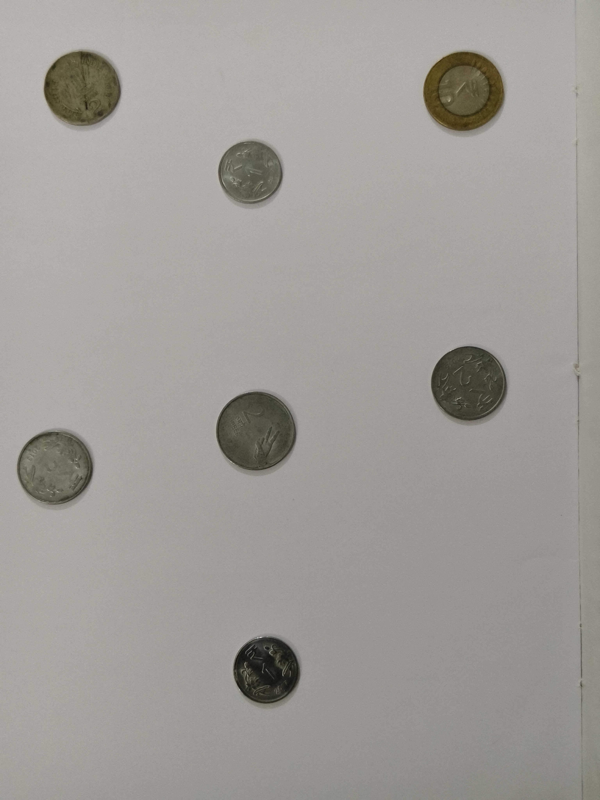

### Sample Outputs

#### Coins Detected

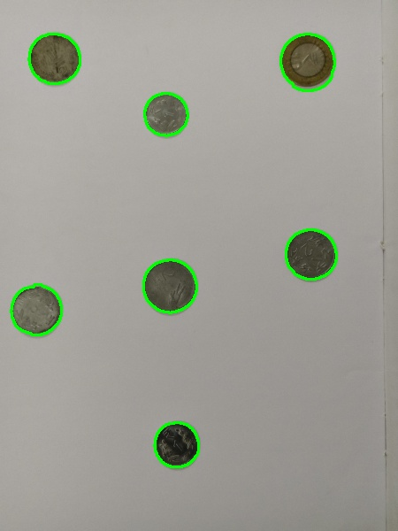

#### Segmented Coin 

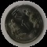
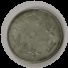
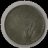
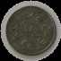
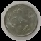
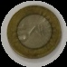
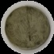


### Findings
- The Canny edge detection method generally provides the most robust results for coin detection
- The circularity filter effectively distinguishes coin-shaped objects from other shapes
- Morphological closing with a kernel size of 5 works well for connecting broken edges in most coin images


## Part 2: Panorama Creation

### Overview
This project implements panorama image stitching using OpenCV. The program takes multiple overlapping images as input and creates a seamless panorama by detecting key features, matching them across images, and blending the images together.

### Dependencies
- Python 3.x
- OpenCV (`cv2`)
- Custom utility module (`utils`) with `save_image` function

To install the required packages:
```
pip install opencv-python
```

### Project Structure
```
├── panorama.py           # Main code for panorama creation
├── utils.py              # Utility functions
├── photos/               # Input images
│   └── panorama/
│       ├── Room-01.jpg
│       ├── Room-02.jpg
│       ├── Room-03.jpg
│       └── Room-04.jpg
└── output/               # Output directory
    └── panorama/
        ├── keypoints_0.jpg
        ├── keypoints_1.jpg
        ├── keypoints_2.jpg
        ├── keypoints_3.jpg
        └── panorama.jpg
```

### How to Run
1. Make sure all dependencies are installed
2. Place your overlapping images in the `photos/panorama/` directory
3. Run the script:
```
python panorama.py
```
4. The results will be saved in the `output/panorama/` directory

### Methods Used

#### 1. Feature Detection
The code uses the ORB (Oriented FAST and Rotated BRIEF) feature detector to identify distinctive points in each image. ORB is rotation-invariant and resistant to noise, making it suitable for panorama stitching.

```python
orb = cv2.ORB_create(nfeatures=4000)
keypoints, descriptors = orb.detectAndCompute(gray, None)
```

The feature detection process:
- Converts images to grayscale for more robust feature detection
- Identifies up to 4000 keypoints per image
- Computes descriptors for each keypoint
- Visualizes and saves the keypoints for verification

#### 2. Image Stitching
The actual stitching is performed using OpenCV's `cv2.Stitcher` class, which handles:
- Feature matching between images
- Homography calculation to determine geometric relationships
- Image warping to align all images to the same plane
- Blending to create seamless transitions

```python
stitcher = cv2.Stitcher_create()
status, panorama = stitcher.stitch(images)
```

### Results and Observations

The program generates:
1. Keypoint visualization for each input image (saved as `keypoints_X.jpg`)
2. The final panorama image (saved as `panorama.jpg`)

The quality of the final panorama depends on several factors:
- Amount of overlap between images (30-50% is recommended)
- Consistency in lighting conditions across images
- Camera movement (preferably rotation around a single point)
- Distinctive features in the overlapping regions

Successful stitching is indicated by:
```
Panorama stitching successful
```

If the stitching fails, the program will output:
```
Panorama stitching failed
```

This could be due to insufficient overlapping areas, extreme perspective changes, or lack of distinctive features in the overlapping regions.

### Sample Inputs

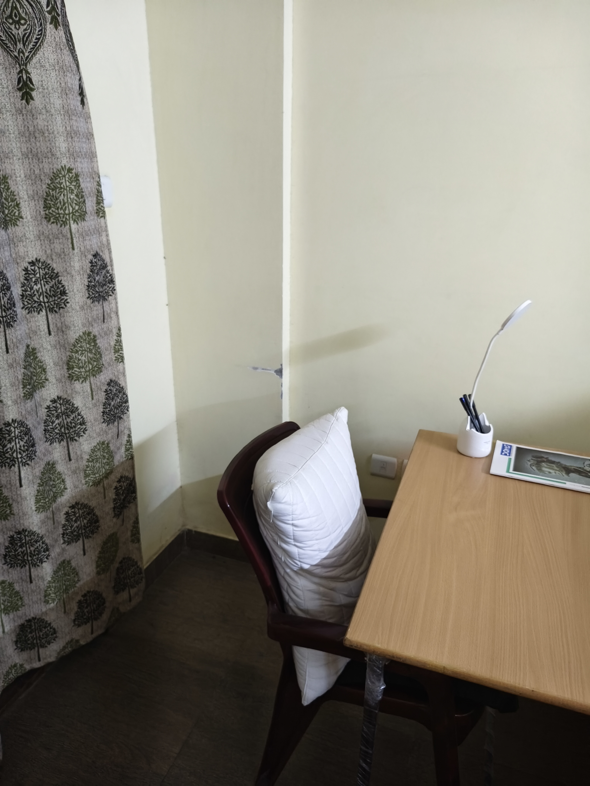


### Sample Outputs

#### Feature Detection
The feature detection step identifies key points in each image, which are then used to find matches between images.

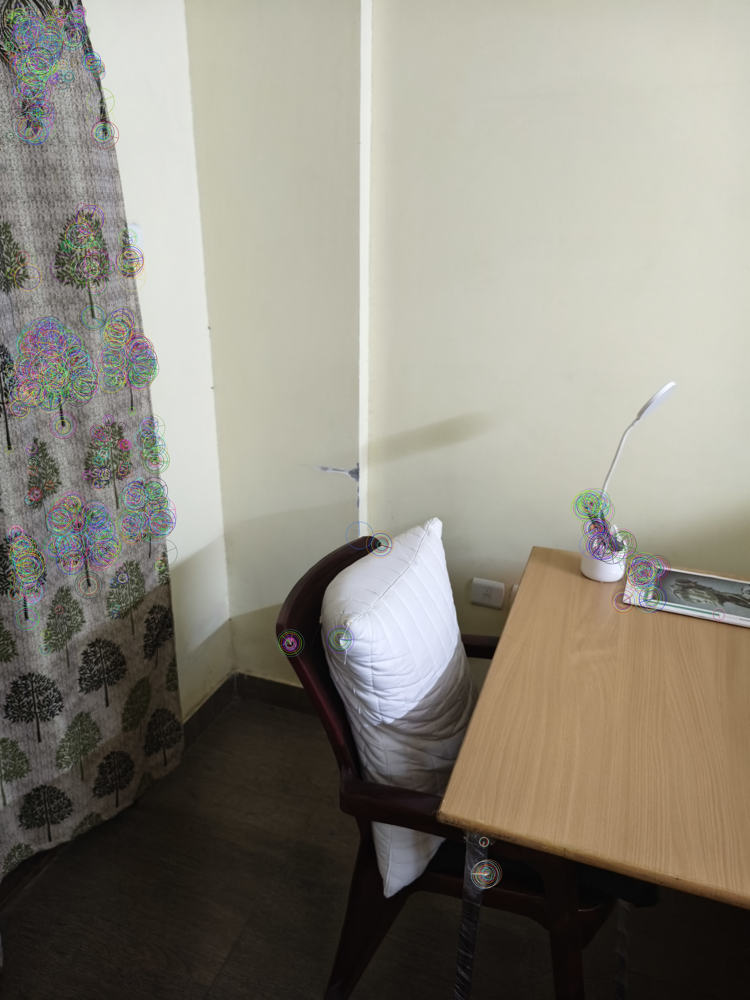


#### Final Panorama
The resulting panorama seamlessly combines all input images into a wider field of view.


